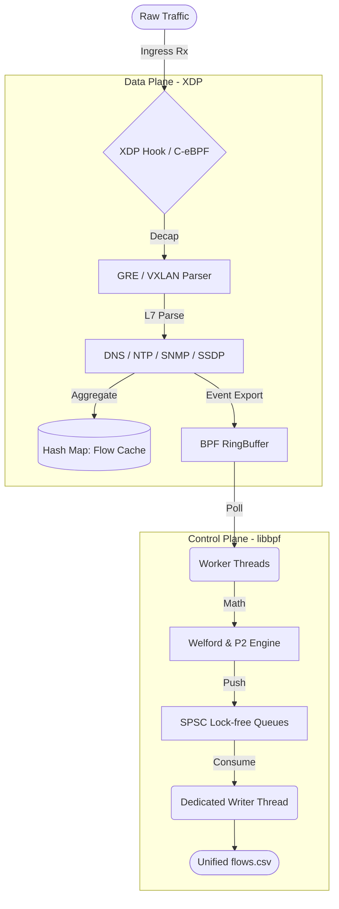

<div align="center">
    
    <h1>Lynceus</h1>
    <i>High-Performance, Dual-Stack (IPv4/IPv6), Stateful Network Feature Extractor Powered by C-eBPF.</i>
    <br>
    <b>Version: 1.0</b>
</div>

<br>

## Abstract

**Lynceus** is a network traffic feature extractor designed to resolve systematic biases and performance bottlenecks in legacy IDS benchmarking. By unrolling the extraction logic into a 100% End-to-End C Architecture utilizing eBPF/XDP for the Data Plane and a deeply optimized libbpf daemon for the Control Plane, it achieves high-throughput processing with minimal overhead.

It implements a Unified Dual-Stack Engine through IPv4-Mapped IPv6 address space, ensuring that both IPv4 and IPv6 traffic are processed through the same O(1) statistical pipeline.

## Etymology and Concept

The name is derived from Lynceus, the Argonaut of Greek mythology. Lynceus was known for his ability to see through physical barriers. This serves as a metaphor for the engine's capability to utilize eBPF/XDP for deep introspection into kernel-space network flows.

## Key Features

1. **Stateful eBPF Interception**: Implements stateful tracking via lock-free `BPF_MAP_TYPE_HASH` tables to ensure stability during high-volume traffic.
2. **Native Tunnel Decapsulation (GRE/VXLAN)**: Performs recursive dissection of encapsulated traffic (GRE/VXLAN) directly in the kernel fast-path, capturing **Tunnel IDs** (GRE Keys / VXLAN VNIs) for infrastructure-aware telemetry.
3. **Deep L7 Visibility (Kernel-Space)**:
   - **DNS**: Advanced parser with support for compression pointers (`0xC0`) and label-skipping (up to 16 labels). Extracts QType, QClass, and AnswerCount.
   - **NTP/SNMP/SSDP**: Native extraction of NTP Mode/Stratum, SNMP PDU Types, and SSDP methods directly from UDP payloads.
4. **High-Scalability I/O (SPSC Lock-free)**: Utilizes a **Single-Producer Single-Consumer** circular buffer per core with **C11 Atomics** (`stdatomic.h`), ensuring linear scalability and zero thread contention.
5. **O(1) Statistics via Welford's Algorithm**: Bidirectional flow features (Standard Deviation, Mean, IAT, Skewness, Kurtosis) are calculated iteratively, ensuring minimal memory footprint.
6. **Online Median Estimation**: Implements the **P² algorithm** for online quantile estimation (Payload, IAT, and Window sizes).
7. **Comprehensive Feature Matrix**: Provides **494 features** per flow record, including 80-bin distribution histograms.

---

## Architecture Blueprint



---

## Build and Usage

### Prerequisites
- Linux Kernel 5.15+
- `clang`, `llvm`, `libbpf`

### Compilation
```bash
make clean && make all
```

### Execution
```bash
sudo ./build/loader <interface_name>
```

---

## ⚖️ License

Distributed under the **GNU General Public License v2.0**.
Designed for high-performance network analysis and community-driven security research.

---
**Lynceus: High-Fidelity Network Telemetry.**
